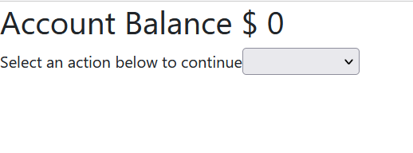

# ATM Machine Exercise

## Description

Simple React ATM for depopsit and cashback application.

## Technologies Used

* _HTML_
* _JavaScript_
* _CSS_

## Installation

* Clone this repository to your local machine.
* Open you command line with the path to the directory to this repository.
* Run npm install http-server and access the page on your browser.

## Improvements 

* 2022-03-26: Submit button is disabled if the value for cashback is greater than the amount in the Account Balance.
* 2022-03-26: The user must select an action at the dropdown in order to display the input elements on the screen.

## Contributions 

Pull requests are welcome. For major changes, please open an issue first to discuss what you would like to change.

## License

[MIT](./LICENSE)